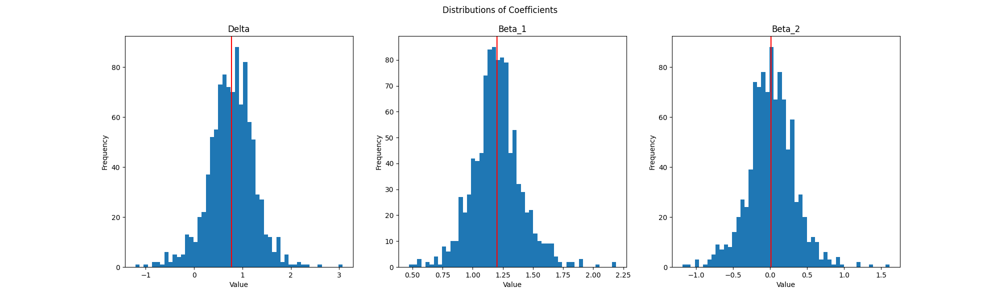

# Assignment 0

## Assignment:
**Part One:**
Write an A4 page research proposal on
1. Broad topic (Corporate events or asset pricing)
2. Identify (possible) data source and variables
3. List 1-2 methods/tool that you want to use and/or want to learn about
4. Propose a specific research question.

**Part Two:**
1. Generate the following random variables:
    1. X1 ∼ N (0, 1), where N (0, 1) is the standard normal distribution
    2. X2 = α + 0.2X1 + ε, where ε ∼ U (−1, 1), where U is the uniform 
    distribution with support of −1 and 1
    3. Y = δ + 1.2X1 + η, where η ∼ exp(λ), where exp(λ) is the exponential distribution
    4. Use N = 10, 000 realizations and set the seed thus your results are reproducible.
    5. Set the parameters as follows: α = 3, δ = −2, λ = 0.5
2. Estimate the following model with OLS and report the coefficients and their standard errors

Yi = δ + β1X1,i + β2X2,i

3. Estimate the same model, but use a rolling window:
    1. Take the first hundred observations: i = 1, ..., 100, then from the 
    second to hundred: i = 2, ..., 101 and do the same until i = 9, 900, ..., 
    10,000
    2. This should result in 1000 estimates for all three coefficients.
    3. Plot the distributions of all coefficients and add the mean as a 
    vertical line to your plot.

## Coding Portion

**My code:**
```python
    import numpy as np
    import matplotlib.pyplot as plt
    import statsmodels.api as sm


    alpha = 3
    delta = -2
    lam = 0.5
    N = 10000
    np.random.seed(0)

    A = np.zeros(shape=(N, 3))
    b = np.zeros(shape=(N, 1))

    for i in range(N):

        x1 = np.random.normal(0,1)


        epsilon = np.random.uniform(-1, 1)
        x2 = alpha + (.2 * x1) + epsilon

        y = delta + (1.2 * x1) + np.random.exponential(lam)
        
        # Yi = delta + B1X1i + B2X2i
        A[i] = [delta, x1, x2]
        b[i] = [y]

    # x = np.linalg.lstsq(b, A)

    x = sm.OLS(b, A)
    results = x.fit()
    print(results.summary())

    alpha = 3
    delta = -2
    lam = 0.5
    N = 10000
    num_estimates = 1000
    np.random.seed(0)

    coefficients = []
    std_errs = []

    for i in range(num_estimates):
        
        A = np.zeros(shape=(int(N/num_estimates), 3))
        b = np.zeros(shape=(int(N/num_estimates), 1))

        for i in range(int(N/num_estimates)):

            x1 = np.random.normal(0,1)


            epsilon = np.random.uniform(-1, 1)
            x2 = alpha + (.2 * x1) + epsilon

            y = delta + (1.2 * x1) + np.random.exponential(lam)
            
            # Yi = delta + B1X1i + B2X2i
            A[i] = [delta, x1, x2]
            b[i] = [y]

        x = sm.OLS(b, A)
        results = x.fit()

        coefficients.append(results.params)
        std_errs.append(results.HC3_se)


    fig, axs = plt.subplots(ncols=3, nrows=1, figsize=(20, 6))


    deltas = np.array([ d[0] for d in coefficients ])

    axs[0].hist(deltas, bins=50)
    axs[0].axvline(deltas.mean(), color='r')

    axs[0].set_xlabel("Value")
    axs[0].set_ylabel("Frequency")
    axs[0].set_title("Delta")

    Beta_1 = np.array([ b_1[1] for b_1 in coefficients ])

    axs[1].hist(Beta_1, bins=50)
    axs[1].axvline(Beta_1.mean(), color='r')
    axs[1].set_xlabel("Value")
    axs[1].set_ylabel("Frequency")
    axs[1].set_title("Beta_1")

    Beta_2 = np.array([ b_2[2] for b_2 in coefficients ])

    axs[2].hist(Beta_2, bins=50)
    axs[2].axvline(Beta_2.mean(), color='r')
    axs[2].set_xlabel("Value")
    axs[2].set_ylabel("Frequency")
    axs[2].set_title("Beta_2")

    fig.suptitle("Distributions of Coefficients")

    plt.savefig("coefficient-distributions.png")

    plt.show()
```

**Output:**
```
                                OLS Regression Results
    ==============================================================================
    Dep. Variable:                      y   R-squared:                       0.847
    Model:                            OLS   Adj. R-squared:                  0.847
    Method:                 Least Squares   F-statistic:                 2.770e+04
    Date:                Wed, 25 Jan 2023   Prob (F-statistic):               0.00
    Time:                        22:19:11   Log-Likelihood:                -7422.1
    No. Observations:               10000   AIC:                         1.485e+04
    Df Residuals:                    9997   BIC:                         1.487e+04
    Df Model:                           2
    Covariance Type:            nonrobust
    ==============================================================================
                     coef    std err          t      P>|t|      [0.025      0.975]
    ------------------------------------------------------------------------------
    const          0.7622      0.013     57.355      0.000       0.736       0.788
    x1             1.1978      0.005    222.800      0.000       1.187       1.208
    x2             0.0083      0.009      0.956      0.339      -0.009       0.025
    ==============================================================================
    Omnibus:                     4616.475   Durbin-Watson:                   1.987
    Prob(Omnibus):                  0.000   Jarque-Bera (JB):            29975.572
    Skew:                           2.130   Prob(JB):                         0.00
    Kurtosis:                      10.335   Cond. No.                         11.4
    ==============================================================================

    Notes:
    [1] Standard Errors assume that the covariance matrix of the errors is correctly specified.
```


The file can be found [here.](./solution.py)

## Research Proposal:

The proposal can be found [here.](./Kaminer-Predicting-Activist-Investing.pdf)
